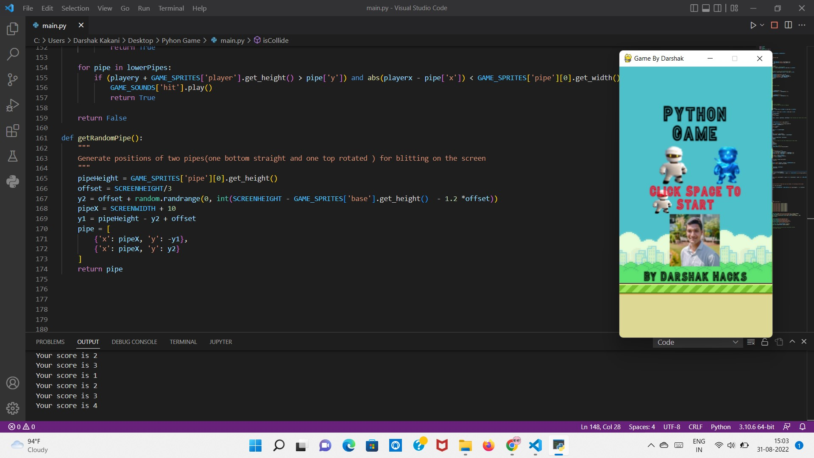
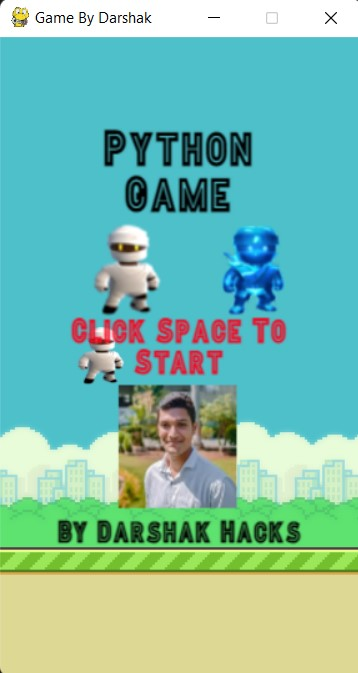
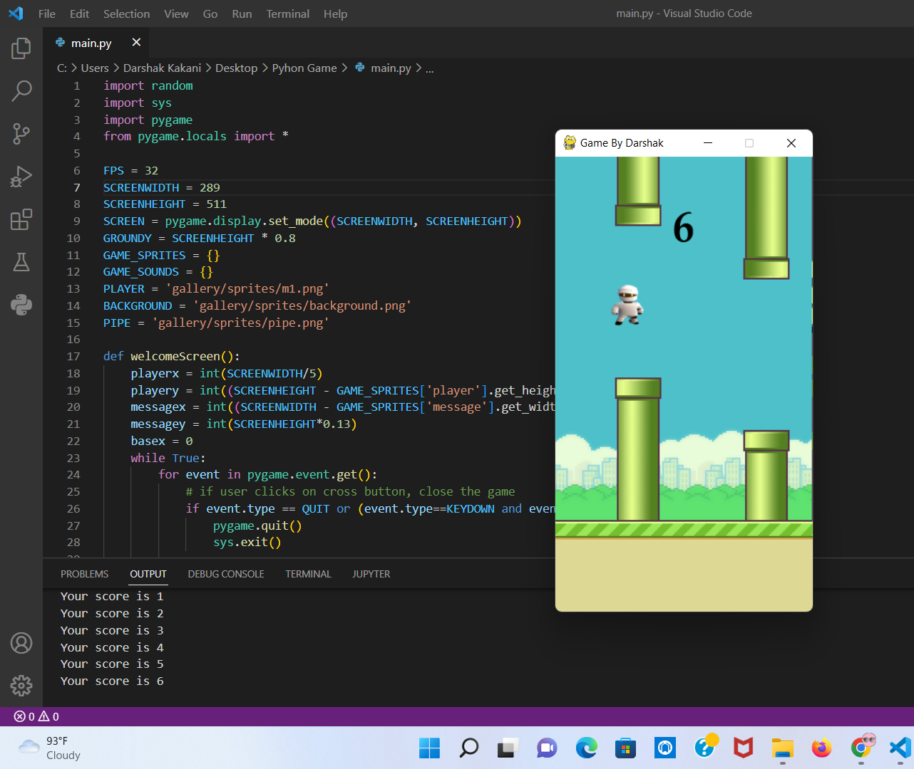

# Flappy Bird Python Game

In this project I create a one intresting game using python. In this I was used Pygame module. I also atteched one gallery folder for audio and sprites which contains all audio and photos for game.


## Authors

- [@Darshak1Just](https://www.github.com/Darshak1Just)


## Contributing

Contributions are always welcome!

See `contributing.md` for ways to get started.

Please adhere to this project's `code of conduct`.


# Screenshorts





## Running Tests

To run tests, run the following command

```bash
  python3 main.py
```

